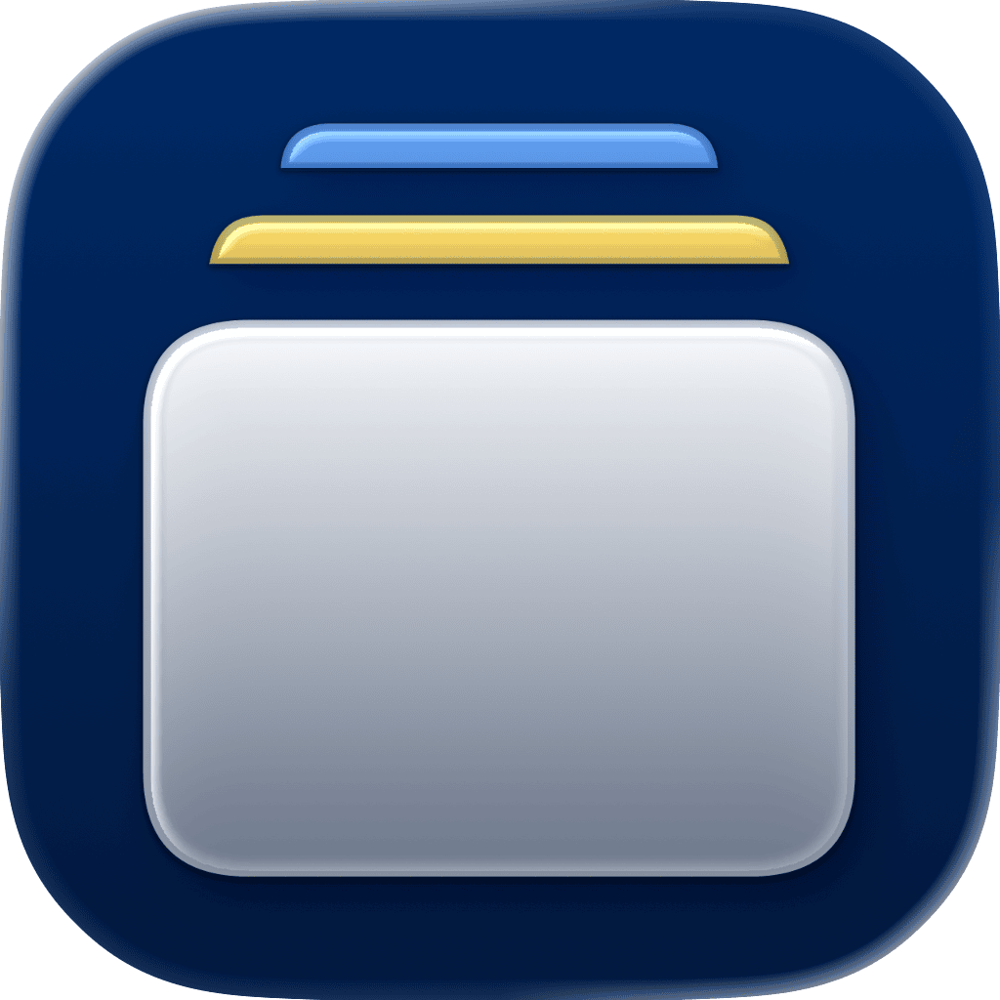

<p align="center">
    
</p>

<p align="center">
    
    
    <a href="https://danielsaidi.github.io/PresentationKit"></a>
    <a href="https://github.com/danielsaidi/PresentationKit/blob/main/LICENSE"></a>
</p>


# PresentationKit

PresentationKit is a SwiftUI library that makes it easy to present alerts, sheets, full screen covers, and toasts for any model, using an observable `Presentation` class.

<p align="center">
    
</p>


## Installation

PresentationKit can be installed with the Swift Package Manager:

```
https://github.com/danielsaidi/PresentationKit.git
```


## Supported Platforms

PresentationKit supports iOS 17, tvOS 17, macOS 14, watchOS 10, and visionOS 1.


## Getting Started

PresentationKit has features for value-based navigation and presentation, and lests you present alerts, sheets, full screen covers, and toasts in the same way. See the [documentation][Documentation] for more information.


### Navigation

The `Navigation` class makes it easy to perform value-based navigation with a navigation stack.

```swift
struct MyView: View {

    @State var navigation = Navigation()

    var body: some View {
        NavigationStack(path: $navigation.path) {
            Button("Push view") {
                navigation.push("detail")
            }
            .navigationDestination(for: String.self) { value in
                Text(value)
            }
        }
    }
}
```

See the [Navigation article][Navigation] for more information.


### Presentation

The `Presentation` class is the foundation for presenting alerts, sheets, covers, and toasts. It holds an optional item that can be presented and dismissed.

```swift
struct MyView: View {

    @State var sheet = Presentation<MyContent>()

    var body: some View {
        Button("Show sheet") {
            sheet.present(.someValue)
        }
        .sheet(for: $sheet) { content in
            MySheetView(content: content)
        }
    }
}
```

See the [Presentation article][Presentation] for more information.


### Alerts

The `.alert(for:content:)` modifier presents an alert for any `Presentation` instance. Return an `AlertMessage` for the item to present.

```swift
struct MyView: View {

    @State var alert = Presentation<MyContent>()

    var body: some View {
        Button("Show alert") {
            alert.present(.someValue)
        }
        .alert(for: $alert) { content in
            AlertMessage(title: content.title) {
                Button("OK") {}
            } message: {
                Text(content.message)
            }
        }
    }
}
```

Types that implement `ErrorAlerter` can perform throwing async operations with automatic error alerts. If the error conforms to `AlertableError`, `.alert(for:)` maps it to an `AlertMessage` automatically.

See the [Alerts article][Alerts] for more information.


### Sheets

The `.sheet(for:content:)` modifier presents a sheet for any `Presentation` instance. PresentationKit also has modifiers for animated size changes and size-to-fit behavior.

```swift
struct MyView: View {

    @State var sheet = Presentation<MyContent>()

    var body: some View {
        Button("Show sheet") {
            sheet.present(.someValue)
        }
        .sheet(for: $sheet) { content in
            MySheetView(content: content)
                .presentationDetents(.sizeToFit, additional: [.medium, .large])
                // animated sheets: .presentationDetents(animated: size, manual: [.medium])
        }
    }
}
```

See the [Sheets article][Sheets] for more information.


### Full Screen Covers

The `.fullScreenCover(for:content:)` modifier presents a full screen cover for any `Presentation` instance.

```swift
struct MyView: View {

    @State var cover = Presentation<MyContent>()

    var body: some View {
        Button("Show cover") {
            cover.present(.someValue)
        }
        #if !os(macOS)
        .fullScreenCover(for: $cover) { content in
            MyCoverView(content: content)
        }
        #endif
    }
}
```

See the [Full Screen Covers article][FullScreenCovers] for more information.


### Toasts

The `.toast(for:edge:content:)` modifier presents a toast for any `Presentation` instance. Toasts slide in from a screen edge and auto-dismiss after a configurable duration.

```swift
struct MyView: View {

    @State var toast = Presentation<MyToast>()

    var body: some View {
        Button("Show toast") {
            toast.present(.init(message: "Hello!"))
        }
        .toast(for: $toast) { item in
            ToastMessage(item.message)
                .padding()
        }
    }
}
```

Use `.toastDuration(seconds:)` on the content view to customize the auto-dismiss duration, and `edge: .bottom` to slide in from the bottom edge.

See the [Toasts article][Toasts] for more information.


## Documentation

The online [documentation][Documentation] has more information, articles, code examples, etc.


## Demo Application

The `Demo` folder has a demo app that lets you explore the library.


## Support My Work

You can [become a sponsor][Sponsors] to help me dedicate more time on my various [open-source tools][OpenSource]. Every contribution, no matter the size, makes a real difference in keeping these tools free and actively developed.


## Contact

Feel free to reach out if you have questions, or want to contribute in any way:

* Website: [danielsaidi.com][Website]
* E-mail: [daniel.saidi@gmail.com][Email]
* Bluesky: [@danielsaidi@bsky.social][Bluesky]
* Mastodon: [@danielsaidi@mastodon.social][Mastodon]


## License

PresentationKit is available under the MIT license. See the [LICENSE][License] file for more info.


[Email]: mailto:daniel.saidi@gmail.com
[Website]: https://danielsaidi.com
[GitHub]: https://github.com/danielsaidi
[OpenSource]: https://danielsaidi.com/opensource
[Sponsors]: https://github.com/sponsors/danielsaidi

[Bluesky]: https://bsky.app/profile/danielsaidi.bsky.social
[Mastodon]: https://mastodon.social/@danielsaidi
[Twitter]: https://twitter.com/danielsaidi

[Documentation]: https://danielsaidi.github.io/PresentationKit
[License]: https://github.com/danielsaidi/presentationkit/blob/master/LICENSE

[Navigation]: https://danielsaidi.github.io/PresentationKit/documentation/presentationkit/navigation-article
[Presentation]: https://danielsaidi.github.io/PresentationKit/documentation/presentationkit/presentation-article
[Alerts]: https://danielsaidi.github.io/PresentationKit/documentation/presentationkit/alerts-article
[Sheets]: https://danielsaidi.github.io/PresentationKit/documentation/presentationkit/sheets-article
[FullScreenCovers]: https://danielsaidi.github.io/PresentationKit/documentation/presentationkit/full-screen-covers-article
[Toasts]: https://danielsaidi.github.io/PresentationKit/documentation/presentationkit/toasts-article
